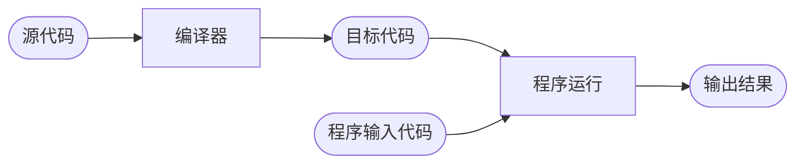
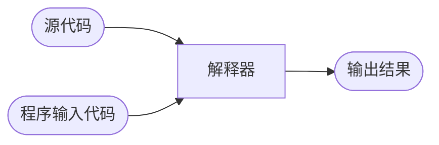
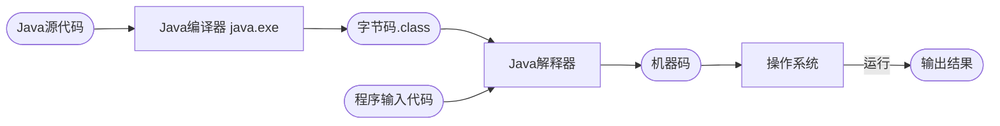
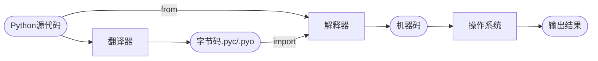

### 编译流程

源代码：在IDE中采用某编程语言写的程序，人类可读性强。

目标代码：根据规则转换的计算机可执行程序，人类不可读（底层相关专家除外）。

执行编译过程的程序叫编译器。

目标代码由机器指令组成，一般不能独立运行，因为源代码中可能使用了某些汇编程序不能解释引用的库函数，而库函数代码又不在源程序中，此时还需要链接程序完成外部引用和目标模块调用的链接任务，最后输出可执行代码。

用编译的方式执行的语言叫静态语言，包括C/C++语言、Java语言等。

### 解释流程

执行解释过程的程序叫解释器。用解释的方式执行的语言叫脚本语言，包括Python语言、JavaScript语言、PHP语言等。

### 编译和解释的对比

|          | 编译                                                         | 解释                                                         |
| -------- | ------------------------------------------------------------ | ------------------------------------------------------------ |
| 特点     | 一次性将源代码转换成目标代码                                 | 逐条提取源代码，再转换成目标代码                             |
| 过程     | 经过编译、汇编和链接才能输出目标代码，然后机器执行目标代码，得出运行结果 | 每次运行都转换成字节码，再由虚拟机转换成机器语言，最后在硬件上运行 |
|          | eclipse、idea（开发）JIT（服务器）                           | VScode、PyCharm（开发）                                      |
| 实操例子 | 编译成的jar文件可以直接发给其他服务器或开发环境中运行        |                                                              |

| 语言     | 优点/缺点                                | 原因                                       |
| :------- | ---------------------------------------- | ------------------------------------------ |
| 静态语言 | 优化的更充分，运行更快                   | 编译器可一次性生成目标代码                 |
|          | 老旧版本容易流失源代码                   | 编译完成，只运行目标代码即可，源代码被弃置 |
| 脚本语言 | 源代码不会丢失                           | 执行时必须源代码                           |
|          | 部分修改源代码可不必再次执行即可输出结果 | 解释时不解释非必要参数，运行中才会解释     |

### 再看Java & Python

Java很特殊，在编译的基础上又添加了Java虚拟机（JVM）。Java程序需要编译，但是没有直接编译称为机器语言，而是编译称为字节码（.class文件），然后在Java虚拟机上用解释方式执行字节码。

(Java虚拟机对字节码的执行相当于用软件模拟一个cpu，而ruby1.8--在虚拟机还未出现前--是通过解释成语法树执行。)

**所以说Java运行过程中既需要编译器，又需要解释器（jdk或jre目录下bin目录中的java.exe文件，是JVM非常重要的一部分）。**

那么Java的解释器是如何运行的呢？

Java配置环境变量时，其中CLASSPATH包含一个或多个目录，用来查找.class文件（字节码）的根目录。Java执行过程中，将得到根目录与CLASSPATH中的各个不同的项相连接，解释器就在这些目录中查找与开发人员创建的类名称相关.class文件的。

然后解释器将这些字节码翻译为机器码，机器码是直接跨过操作系统的cpu指令代码。JVM虽然运行在操作系统上，但是它生成的机器码文件是直接对应与不同指令集架构的cpu。

Python是一个解释型的语言。但是为了效率上的考虑，Python也提供了编译的方法。

（就是说Python也有类似Java的编译模式，先将Python程序编译成Python字节码，然后由一个专门的Python字节码解释器负责解释执行字节码。）

源代码编译之后是bytecode的形式。Python也提供了和Java类似的VM来执行这样的bytecode。不同的是，因为Python是一个解释型的语言，所以编译（compile）不是一个强制的操作。事实上，编译是一个自动的过程。多数情况下，你甚至不会在意他的存在。编译成bytecode可以节省加载模块的时间，从而提高效率。

**.pyc文件就是Python编译后生成的文件，pyc的目的是重用，即编译成.pyc的文件，最大的优点在于我们在运行程序时，不需要重新对该模块进行重新的解释。Python的解释器认为：只有import进来的模块，才是需要被重用的模块。**

**import源码，在每次执行前都会检查py文件和pyc文件最后修改日期，不一致就会重新生成pyc文件。**

除了效率原因，bytecode也增加了反向工程的难度，在某种程度上保护你的代码。当然，反编译仍然是可以的。所以如果真的想保护代码，还是用别的方法吧。另外Python还提供了-O选项，可以编译生成"优化"的bytecode，文件扩展名是.pyo。但实际上优化的内容有限，作用不大。如果希望生成可执行文件，就要依赖于第三方的工具了。

